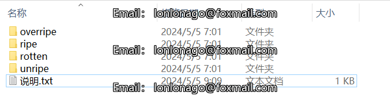
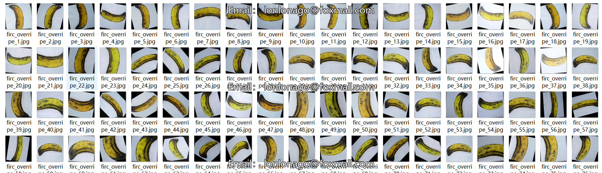
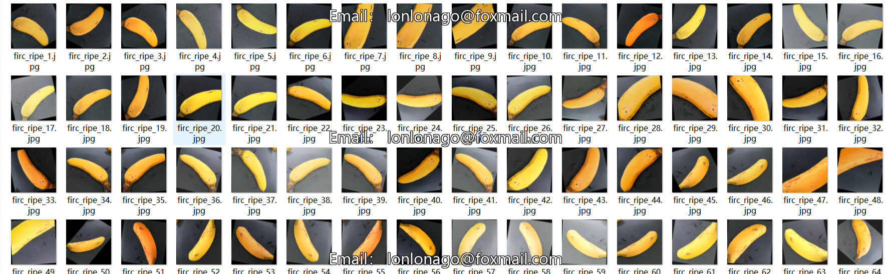
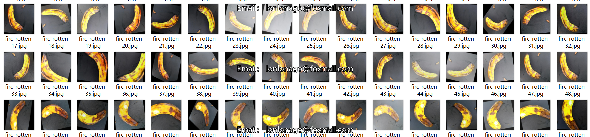
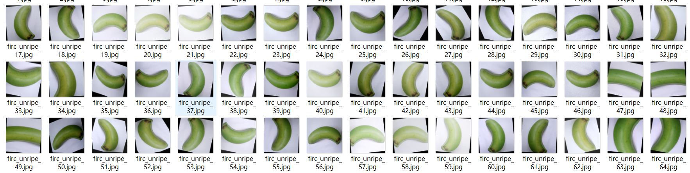

# Classification Dataset: Banana Ripeness Recognition
Classification Dataset for Banana Ripeness Recognition, with a total of 13478 images and 4 classes.

## Dataset Details

- **Size**: 13478 images
- **Number of Classes**: 4
- **Class Names**: ["overripe", "ripe", "rotten", "unripe"]

### Category Information

| Category  | Image Count |
|----------|------------|
| overripe | 2691      |
| ripe     | 4015      |
| rotten   | 4593      |
| unripe   | 2179      |

This dataset is suitable for various classification recognition algorithms such as ResNet, VGG, MobileNet, GoogleNet, etc. If you need to use this dataset for Yolo or other object detection algorithms, you will need to label it using the LabelImg tool. The dataset consists of banana ripeness recognition classification data, divided into five levels: rotten, ripe, mature, and unripe.

## Images

---

Here is a pay link on Stripe (https://buy.stripe.com/3cs8yP7sY87d0vu9AB). Please contact me lonlonago@foxmail.com after funding $89, and I will send you a complete data files, thank you!

